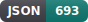
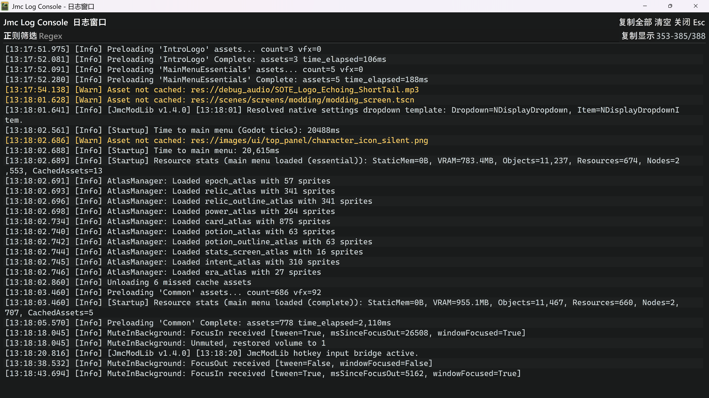
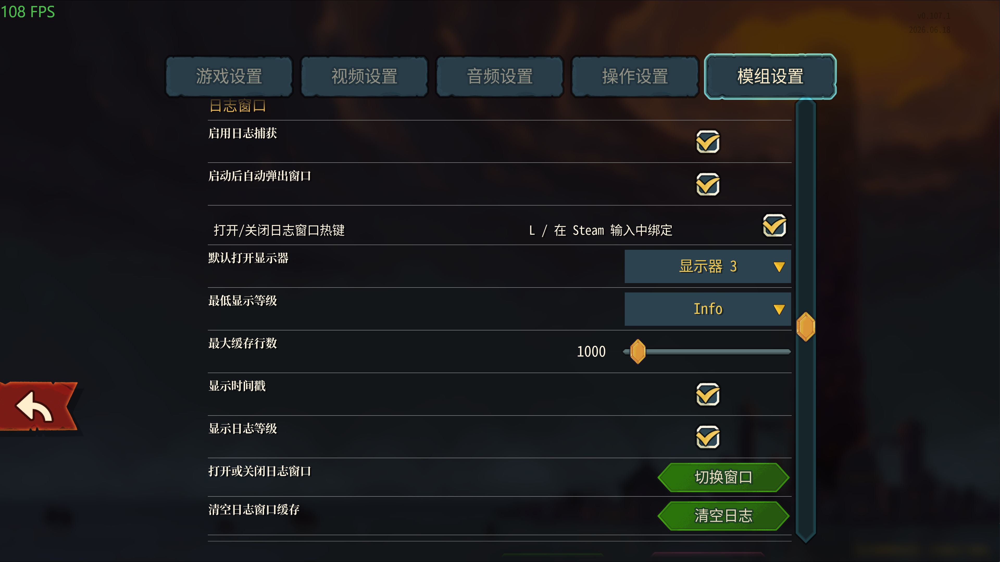
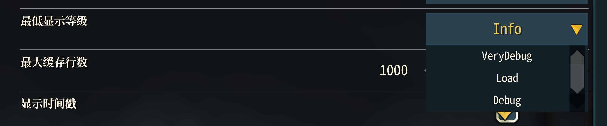
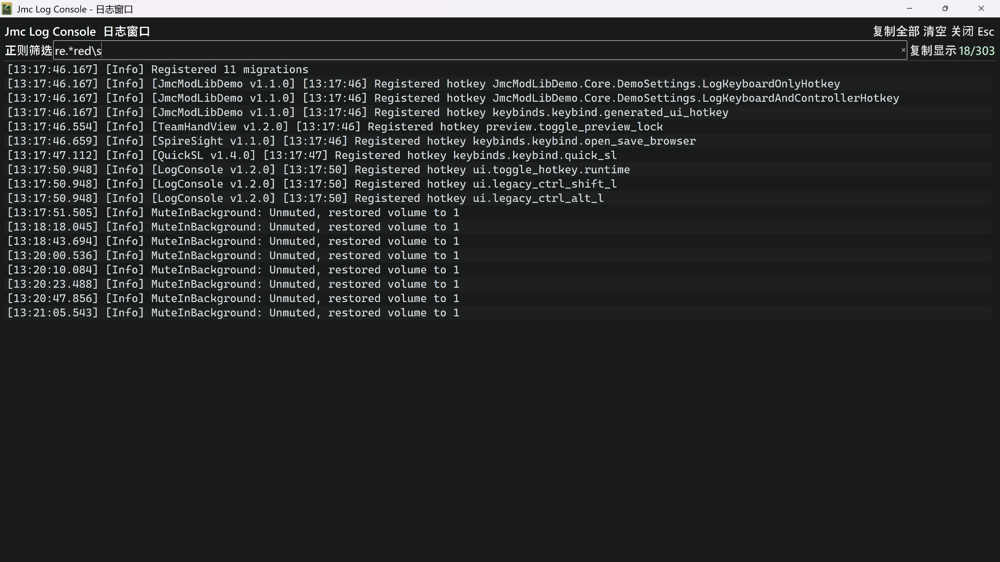

<p align="center">
  <a href="README.md"></a>
  <a href="README_en.md"></a>
  <a href="CHANGELOG.md"></a>
  <a href="https://github.com/JMC-Mods/SlayTheSpire2_LogConsole/releases"></a>
<!-- code-stats:start -->
  <a href="https://github.com/JMC-Mods/SlayTheSpire2_LogConsole/actions/workflows/code-lines.yml"></a>
  <a href="https://github.com/JMC-Mods/SlayTheSpire2_LogConsole/actions/workflows/code-lines.yml"></a>
  <a href="https://github.com/JMC-Mods/SlayTheSpire2_LogConsole/actions/workflows/code-lines.yml"></a>
  <a href="https://github.com/JMC-Mods/SlayTheSpire2_LogConsole/actions/workflows/code-lines.yml"></a>
  <a href="https://github.com/JMC-Mods/SlayTheSpire2_LogConsole/actions/workflows/code-lines.yml"></a>
  <a href="https://github.com/JMC-Mods/SlayTheSpire2_LogConsole/actions/workflows/code-lines.yml"></a>
  <a href="https://github.com/JMC-Mods/SlayTheSpire2_LogConsole/actions/workflows/code-lines.yml"></a>
<!-- code-stats:end -->
</p>

# 日志控制台
##  0. 安装

### Mod本体安装
Steam版本直接在创意工坊订阅即可（暂未开放）

其他版本可以自行编译，或者在[📦 Releases](https://github.com/JMC-Mods/SlayTheSpire2_LogConsole/releases)界面下载.zip后解压到游戏安装目录下的Mods
目录下（没有就新建一个）

### 前置安装
**此外，本模组强依赖于模组[JmcModLib](https://github.com/JMC-Mods/SlayTheSpire2_JmcModLib/releases)**，安装方法同上

安装完成后的目录结构如下：

```sh
-- Slay the Spire 2
    |-- SlayTheSpire2.exe
        |-- mods
             |-- JmcModLib
             |-- LogConsole
                  |-- LogConsole.dll
                  |-- LogConsole.pck
                  |-- LogConsole.json
```

### 存档迁移
> 当你第一次安装MOD，游戏会默认将开启Mod的存档与没开启的隔离，可以按下面的方法迁移存档：

在安装好MOD后第一次打开游戏会询问是否启用MOD，启用并再次打开游戏一次后，退出游戏，将`%appdata%\SlayTheSpire2\steam\`下面的数字文件夹下的你对应的存档文件粘贴到该文件夹的`modded`文件夹中，以同步使用MOD前后的存档

---
## 🧠 1. 简介
在游戏中提供可开关的日志窗口，方便查看、清空和诊断 MOD 日志。

[演示视频（B站）](待定)

[Github仓库](https://github.com/JMC-Mods/SlayTheSpire2_LogConsole)
## ⚙️ 2. 功能
- 显示一个日志窗口，用于在游戏内查看日志

- 可通过热键（可配置，支持手柄、组合键）打开或关闭日志窗口，在设置里可以更改配置

- 可以调整最低显示的等级，筛选出你关注的打印等级

- 多显示器时，可以配置默认显示的显示器位置
 
- 支持正则筛选
 
 
## 🔔 3. 提醒
- **本模组强依赖于模组[JmcModLib](https://github.com/JMC-Mods/SlayTheSpire2_JmcModLib/releases)**
- 日志窗口配置由 JmcModLib 提供，修改后会保存到本地配置文件。
- 本地化文本除中文外由AI生成，欢迎贡献文本。
 
## 🧩 4. 兼容性
- 由于游戏处于EA阶段，可能会随着游戏版本更新而失效

## 🧭 5. TODO
- 待定

**如果你喜欢这个 Mod 的话，希望可以点一个star~**
